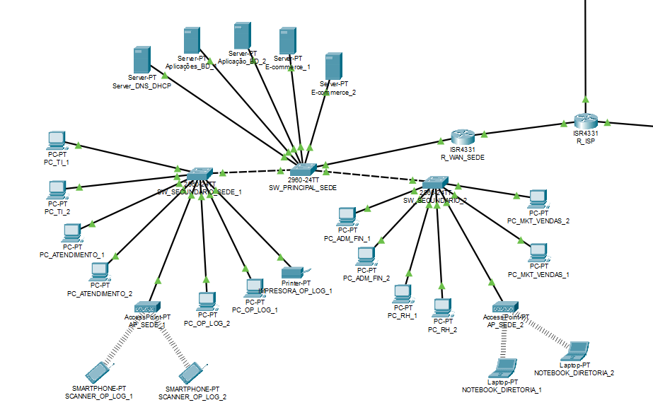
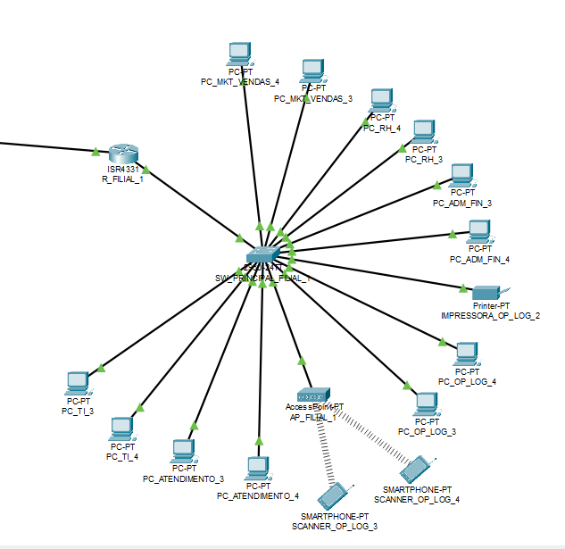

# 🛡️ Projeto Navega Brasil - Arquitetura de Redes e Segurança Corporativa

## 📋 Sobre o Projeto
Este repositório contém o projeto acadêmico de estruturação da infraestrutura de redes e do Plano de Segurança da Informação para o e-commerce "Navega Brasil", uma empresa com atuação nacional. O objetivo principal foi projetar uma rede escalável, de alta disponibilidade e **resiliente a ataques cibernéticos**.

## 🎯 Destaques em Operações de Segurança e Defesa (Blue Team)
* **Arquitetura Segura e Segmentação:** Implementação do Princípio do Menor Privilégio na rede interna utilizando **VLANs** para isolar departamentos críticos.
* **Comunicação Criptografada:** Configuração de túneis **VPN Site-to-Site (IPsec)** interligando a matriz às filiais.
* **Defesa em Profundidade:** Planejamento de controles técnicos como **WAF** na camada 7, adoção de **EDR** para endpoints e exigência de **MFA**.
* **Plano de Resposta a Incidentes:** Estruturação de um fluxo de IR baseado no framework **NIST**.

## 📂 Estrutura do Repositório
* [📄 Projeto A3 - Navega Brasil.pdf](Projeto%20A3%20-%20Navega%20Brasil.pdf): Documento ABNT detalhando a organização, topologia, matriz de riscos e o Plano de Segurança da Informação.
* [🕸️ Projeto A3.pkt](Projeto%20A3.pkt): Arquivo do Cisco Packet Tracer contendo a simulação da rede.

## 🗺️ Mapeamento da Infraestrutura (Cisco Packet Tracer)

**🏢 Unidade Sede (Sudeste) - Topologia Estrela Hierárquica**
Data Center principal (Servidores WEB, DB, E-commerce) isolado em sua própria VLAN.

**📍 Filial 1 (Nordeste) - Topologia Estrela Simples**

**📍 Filial 2 (Norte) - Topologia Estrela Simples**

## 👥 Equipe do Projeto
Carolina Friedrich | Gabriel Roque França | Lucas Kiodi Moraca | Rebeca Martins Teixeira | Sara Marcely Andrade de Oliveira | Vinicius Paulo de Almeida
